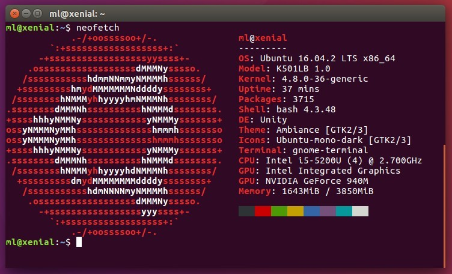

## Linux CLI Tools

<br/>

### Text editors

``
pico
nano
jed
vim
``

<br/>

### System Info
``
top
htop
atop
apachetop
ftptop
mytop
powertop
iotop
iftop
ntopng
jnettop
``

<br/>

### Network
```
dstat
vnstat
netstat
pktstat
ifstat
vmstat
mpstat
iostat
darkstat
nmon
bmon
xymon
strace
dtrace
pmap
nmap
EtherApe
bandwidthd
ethtool
ngrep
iptraf
ethtool
nethogs
iptstate
nload
slurm
tcptrack
```

<br/>

### Other

```
bwm-ng
cbm - Color Bandwidth Meter
speedometer
netwatch
trafshow
netdiag
netload
ss
collectl
mtr
tcpdump
justniffer
glances
saidar
df
discus
Net-SNMP
incron
monitorix
sar
acct
psacct
whowatch
ulimit
cpulimit
lshw
lsof
collectd
Zabbix
Graphite
Sensu
ncdu (NCurses Disk Usage)
ashmon
lspci
lsusb
lsblk
mobaxterm (replaced PuTTY, Exceed, ReflectionX, mRemoteNG, Mstsc and WinSCP)
Observium
```

sudo apt-get install wavemon

<br/>

### MyCli DB tool

Once mycli installed, you can use it like this:

```
$ mycli -u root -h localhost
```

To login into mysql and select a database at the same time, you may use a similar command as follows.
```
$ mycli local_database
$ mycli -h localhost -u root app_db
$ mycli mysql://amjith@localhost:3306/django_poll
```

For more usage options, type:
```
$ mycli --help
```


```
siege – An HTTP/HTTPS stress load tester
mtr – Traceroute+ping in a single network diagnostic tool
multitail – Tail command on steroids
netcat – TCP/IP swiss army knife
s-tui
gtop: Awesome system monitoring dashboard
```

```
uptime
```

<br/>

### How do I know my computer has 32-bit or 64-bit UEFI firmware?

On Linux run the following command.
```
cat /sys/firmware/efi/fw_platform_size
64
```

<br/>


### NeoFetch: Linux System Information



```
neofetch
```
